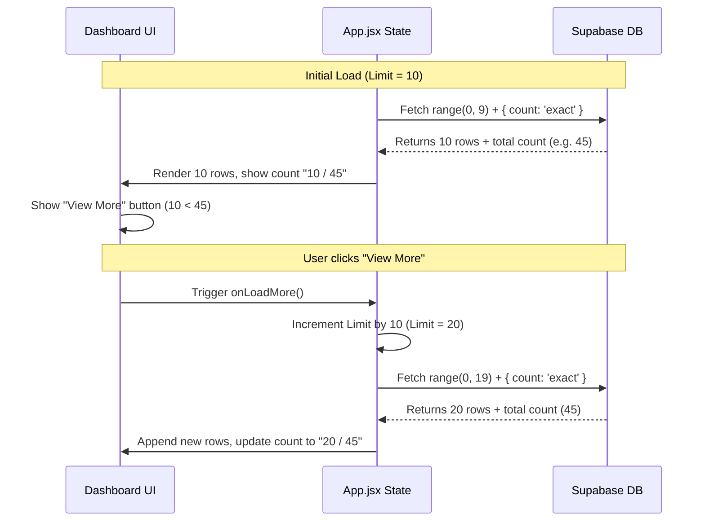

# Observe Insurance Dashboard

Observe Insurance is a live, production-ready dashboard application that displays real-time customer insurance claims and call logs. The application is built using React, Vite, Supabase, and Vanilla CSS.

---

## Technical Architecture & Project Structure

The project follows a modular, client-side rendering model:

```
├── .env                  # Local environment configuration
├── index.html            # Entry HTML template with SEO meta tags
├── package.json          # Dependency and build script configuration
├── vite.config.js        # Vite bundler options
└── src
    ├── main.jsx          # React app mount and StrictMode wrapper
    ├── App.jsx           # Main dashboard container, state management, and fetch loops
    ├── index.css         # Styling system, responsive layout definitions, and animations
    ├── supabaseClient.js # Supabase client singleton setup
    └── components
        ├── CustomersTable.jsx # Renders customer claims status table and "View More" button
        └── CallLogsTable.jsx  # Renders call logs table, sentiment badges, and "View More" button
```

---

## Technical Implementations

### 1. Robust Env URL Sanitization (Vercel Compatibility)
When deploying environments to platforms like Vercel, values in the console may be formatted with enclosing quotes (`"..."`), escaped backslashes (`\"...\"`), or URL-encoded quotes (`%22...%22`). If passed directly to `window.open`, the browser fails to resolve the protocol and defaults to a relative path against the current Vercel origin.

To ensure it works reliably in production, the application utilizes an aggressive regex filter when opening the Vite Voice URL:
```javascript
const cleanUrl = rawUrl.replace(/^["'\\%22%27\s]+|["'\\%22%27\s]+$/gi, '');
window.open(cleanUrl, '_blank', 'noopener,noreferrer');
```
This strips any combination of leading or trailing double quotes, single quotes, backslashes, percent-encoded quotes, and whitespaces, ensuring a clean absolute URL is opened.

### 2. State Syncing & Safe Component Mounting
The dashboard refreshes its tables automatically at an interval set by `VITE_SYNC_INTERVAL_MS` (defaulting to 60 seconds). To avoid React warnings and memory leaks:
- Initial fetches are deferred using a `setTimeout` to move the state updates to the next macro-task. This prevents the ESLint `react-hooks/set-state-in-effect` warning by avoiding synchronous `setState` executions during rendering.
- An `active` flag is set to `true` during the effect and set to `false` during the cleanup phase. State updates are checked against this flag to guarantee they don't fire if the component has unmounted.
- `useRef` is leveraged to check if the initial fetch has already fired, satisfying ESLint's `react-hooks/exhaustive-deps` without triggering infinite reload loops.

---

## How the Pagination Works

To prevent loading the entire database into memory, the application implements a **Server-Side Range Querying** pagination mechanism. Rather than loading everything, it fetches records in segments (pages of 10) and provides a **View More** button to query subsequent blocks.



### The Code Behind the Mechanism

#### 1. Range Selection & Exact Count Querying
When querying Supabase, the application asks for a range of rows based on the current page size (`limit`) and requests the exact count of total matches in the database using the `{ count: 'exact' }` parameter:
```javascript
const { data, error, count } = await supabase
  .from('call_logs')
  .select('*', { count: 'exact' })
  .order('timestamp', { ascending: false })
  .range(0, limit - 1);
```
- `.range(0, limit - 1)` ensures that if the limit is `10`, Supabase returns only index `0` to `9`.
- `{ count: 'exact' }` retrieves the absolute count of records in that table and stores it in the `count` variable.

#### 2. Pagination State Tracking (`App.jsx`)
`App.jsx` stores separate limit, count, and loading states for each dataset:
```javascript
const [customers, setCustomers] = useState([]);
const [customersLimit, setCustomersLimit] = useState(10);
const [customersCount, setCustomersCount] = useState(0);
const [loadingCustomers, setLoadingCustomers] = useState(true);
```
When `customersLimit` changes (e.g., when the user clicks "View More"), a `useEffect` triggers `fetchCustomers` with the new limit:
```javascript
useEffect(() => {
  let active = true;
  const initTimer = setTimeout(() => {
    if (active) {
      const isInitial = !customersLoadedRef.current;
      if (isInitial) customersLoadedRef.current = true;
      fetchCustomers(customersLimit, isInitial);
    }
  }, 0);
  return () => {
    active = false;
    clearTimeout(initTimer);
  };
}, [customersLimit, fetchCustomers]);
```

#### 3. Displaying and Triggering the "View More" UI
The table components receive `rows`, `loading`, `totalCount`, and `onLoadMore` as props.
The count indicator in the card header displays the total DB count:
```jsx
<span className="count">{loading && rows.length === 0 ? '…' : totalCount}</span>
```
At the bottom of the table, if the currently loaded `rows.length` is less than `totalCount`, the **View More** button is rendered:
```jsx
{rows.length < totalCount && (
  <div className="card-footer">
    <button 
      onClick={onLoadMore} 
      className="load-more-btn" 
      disabled={loading}
    >
      {loading ? 'Loading...' : 'View More'}
    </button>
  </div>
)}
```
When clicked, the button triggers `onLoadMore` which increments the stateful limit in `App.jsx` by 10 (`prev => prev + 10`), firing the range query to retrieve the expanded dataset.

---

## Responsive Mobile Design

The styling system defined in `index.css` adapts to varying screen resolutions to ensure a fluid visual layout:

### 1. Flexible Header Wrapping
On desktop viewports, the header items are lined up horizontally using `justify-content: space-between`. On mobile viewports (`max-width: 768px`), they stack vertically to prevent squishing and awkward line breaks:
- The title "Observe Insurance" and the status badge reside side-by-side on the top row.
- The control button ("Start Call") and sync timer take up the bottom row.

### 2. Smooth Touch Scrolling
The dashboard tables are contained within an `.table-wrap` wrapper configured with:
```css
.table-wrap {
  overflow-x: auto;
  -webkit-overflow-scrolling: touch; /* Promotes native kinetic inertia scrolling on iOS */
}
```
This configuration keeps table cards intact on small viewports while allowing users to swipe to browse column details.

### 3. Snipped Mobile Padding
Media queries at `max-width: 600px` compress padding within cards and cells (`12px 14px` instead of `16px 20px`), rendering details snugly on high-resolution smartphone screens.

---

## Local Development Setup

### Installation
```bash
npm install
```

### Environment Variables
Create a `.env` file in the root directory:
```env
VITE_SUPABASE_URL=your_supabase_project_url
VITE_SUPABASE_ANON_KEY=your_supabase_anon_key
VITE_VOICE_URL=your_voice_assistant_url
VITE_SYNC_INTERVAL_MS=60000
```

### Available Scripts
- `npx vercel dev` - Launches the Vercel local development environment hosting both the Vite web application and the serverless functions (`/api/*`).
- `npm run build` - Builds production-optimized bundle into `/dist`.
- `npm run lint` - Validates codebase using ESLint checks.
